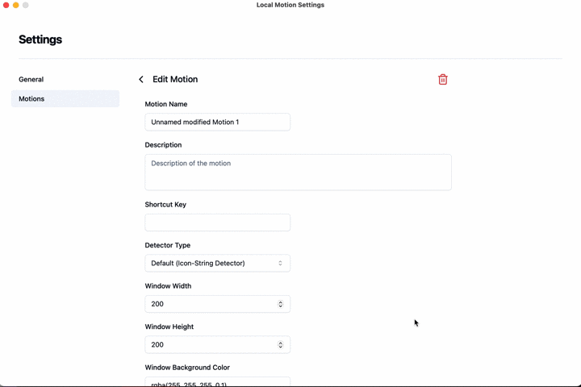

# Whole Image detector



Whole Image detector returns just bouding box of whole image with some paddings.

This means that for any given image, regardless of its content, this custom detecor returns
```
{
    boxes: [[0.1, 0.1, 0.9, 0.9]]
}
```
Combined with motion box position settings in Local Motion, motion condidates are displayed based on the window size, regardless of what objects are present in the image.

### Prerequisite

- Install Docker and Docker-compose

### Usage

1. Run Web API in local environment by following commands

```
docker-compose build
docker-compose up
```
2. In the settings of Local Motion, choose custom detector and set URL as `http://localhost:8101/whole-image-detection`
3. Choose Motion Box Positions in settings of Local Motion. If you choose all positions, 9 motion candicates will be shown according to the size of the window. As examples of Motion settings, "3x3 Matrix Motion" is shown below.

```
{
  "id": "9baa1f94-0952-43ad-9ce2-bb02891d368e",
  "name": "3x3 Matrix Motion",
  "description": "3x3 Matrix motion candicates will be shown according to the size of the window.",
  "globalShortcutKey": "Ctrl+Alt+T",
  "detectorType": "custom",
  "detectorUrl": "http://localhost:8101/whole-image-detection",
  "windowWidth": 200,
  "windowHeight": 200,
  "windowBackgroundColor": "rgba(255, 255, 255, 0.1)",
  "fontSize": 15,
  "textColor": "rgba(0, 0, 0, 1)",
  "textBoxColor": "rgba(255, 197, 66, 1)",
  "postAction": "left-click",
  "motionBoxPositions": [
    "center",
    "top-left",
    "top-middle",
    "top-right",
    "middle-left",
    "middle-right",
    "bottom-left",
    "bottom-middle",
    "bottom-right"
  ]
}
```
