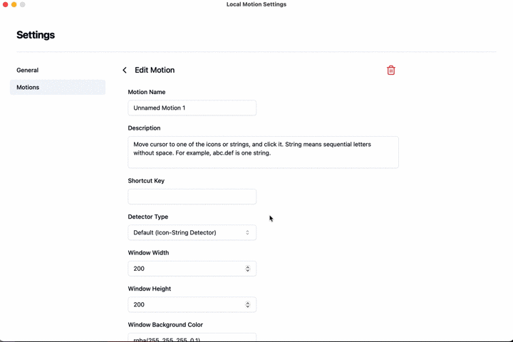

# Word Detector using Google Cloud Vision API



In this example, [Google Cloud Vision API](https://cloud.google.com/vision/docs) is used to detect words for custom detector of [Local Motion](https://github.com/oyam/local-motion).

### Prerequisite

- Install Docker and Docker-compose
- Prepare service account key to use Google Cloud Vision API. As shown in docker-compose.yml, it is assumed that the service account key exists in the `secrets` folder and the name should be `vision-api-service-account-key.json`. For information about service account key, please refer to [official document](https://cloud.google.com/vision/docs/setup#sa).

### Usage

1. Run Web API in local environment by following commands

```
docker-compose build
docker-compose up
```
2. In the settings of Local Motion, choose custom detector and set URL as `http://localhost:8100/word-detection`
3. Choose Motion Box Positions in settings of Local Motion. Setting positions as middle-left, middle-right, or both of them corresponds to motion of first, last, and first/last letters of word respectively. As examples of Motion settings, "Initial Letter Motion" is shown below.

```
{
  "id": "9779fc8d-0384-48e4-b4fb-8b390bf23194",
  "name": "Initial Letter Motion",
  "description": "Move cursor to one of the intial letters of the words in the local window, and click it. Word means sequential letters without any sperator like space or comma. For example, first letters of abc.def are \"a” and \"d\".",
  "globalShortcutKey": "Ctrl+Alt+R",
  "detectorType": "custom",
  "detectorUrl": "http://localhost:8100/word-detection",
  "windowWidth": 200,
  "windowHeight": 150,
  "windowBackgroundColor": "rgba(255, 255, 255, 0.7)",
  "fontSize": 15,
  "textColor": "rgba(255, 0, 0, 0.8)",
  "textBoxColor": "rgba(255, 255, 255, 0)",
  "postAction": "left-click",
  "motionBoxPositions": [
    "middle-left"
  ]
}
```
